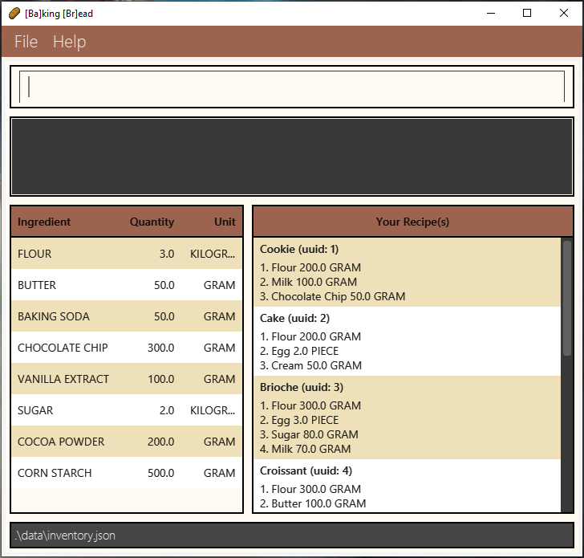

# RecipeBook User Guide

RecipeBook is a **desktop app for managing recipes and ingredient inventory, optimized for use via a  Line Interface** (CLI) while still having the benefits of a Graphical User Interface (GUI). If you can type fast, AB3 can get your contact management tasks done faster than traditional GUI apps.

<!-- * Table of Contents -->
<page-nav-print />

--------------------------------------------------------------------------------------------------------------------

## Quick start

1. Ensure you have Java `11` or above installed in your Computer.

1. Download the latest `recipebook.jar` from [here](https://github.com/se-edu/inventory-level3/releases).

1. Copy the file to the folder you want to use as the _home folder_ for your AddressBook.

1. Open a command terminal, `cd` into the folder you put the jar file in, and use the `java -jar recipebook.jar` command to run the application. 
   A GUI similar to the below should appear in a few seconds. Note how the app contains some sample data. 
   

1. Type the command in the command box and press Enter to execute it. e.g. typing **`help`** and pressing Enter will open the help window. 
   Some example commands you can try:

    * TODO

1. Refer to the [Features](#features) below for details of each command.

--------------------------------------------------------------------------------------------------------------------

## Features

<box type="info" seamless>

**Notes about the command format:** 

* Words in `UPPER_CASE` are the parameters to be supplied by the user. 
  e.g. in `add n/NAME`, `NAME` is a parameter which can be used as `add n/Milk`.

* Items in square brackets are optional. 
  e.g `n/NAME q/QUANTITY [u/UNIT]` can be used as `n/Milk q/1000 u/ml` or as `n/Milk q/1000`.

* Items with `…`​ after them can be used multiple times including zero times. 
  e.g. `[NAME]…​` can be used as ` ` (i.e. 0 times), `milk`, `milk flour` etc.

* Parameters can be in any order. 
  e.g. if the command specifies `n/NAME q/QUANTITY`, `q/QUANTITY n/NAME` is also acceptable.

* Parameters are case-insensitive.
* e.g. A parameter specified as `n/Milk` is functionally identical to `n/MILK` or `n/milk`.

* Extraneous parameters for commands that do not take in parameters (such as `help`, `list`, `exit` and `clear`) will be ignored. 
  e.g. if the command specifies `help 123`, it will be interpreted as `help`.

* If you are using a PDF version of this document, be careful when copying and pasting commands that span multiple lines as space characters surrounding line-breaks may be omitted when copied over to the application.
  </box>

### Viewing help : `help`

Shows a message explaning how to access the help page.

Format: `help`

### Adding an ingredient: `add`

Adds an ingredient to stock.

Format: `add n/NAME q/QUANTITY [u/UNIT]`

<box type="tip" seamless>

**Tip:** If no unit is specified, the default unit for that kind of ingredient will be used. If the ingredient does not have default unit, then grams will be used.
</box>

Examples:
* `add n/Flour q/1 u/kg`
* `add n/Milk q/600 u/ml`
### Using up ingredients : `use`

Depletes a specified amount of an ingredient from stock.

Format: `use n/NAME [q/QUANTITY] [u/UNIT]`

* If no quantity is provided, the entire stock of the specified ingredient will be depleted.
* If the quantity depleted exceeds the current quantity in stock, the entire stock will be depleted but will not go into the negative.

Examples:
*  `use n/Milk q/600 u/ml` Depletes the current quantity of milk by 600 ml.
*  `use n/Egg` Depletes the current quantity of egg by the default amount.

### Finding the quantity of an ingredient by name: `stock`

Lists the quantity of the specified ingredients.

Format: `stock [NAME]…​`

* Multiple ingredients can be specified e.g. `stock Flour Butter` will return the quantities of both ingredients
* If no ingredients are specified, the quantity of all ingredients will be returned
* Only full words will be matched e.g. `Flou` will not match `Flour`
* For ingredients with names comprising multiple words, the first word must be matched e.g. `Bay` will match `Bay Leaves` but `Leaves` will not
* The unit specified will be the default unit of the ingredient

Examples:
* `stock Milk` returns `Milk: 100ml`
* `find milk flour` returns `Milk: 100ml`, `Flour: 2000g` 

### Clearing all entries : `clear`

Clears all entries from the ingredient stock.

Format: `clear`

### Exiting the program : `exit`

Exits the program.

Format: `exit`

### Viewing Recipes `[coming in v1.3]`

### Adding Recipes `[coming in v1.3]`

### Modifying Recipes `[coming in v1.3]`

### Saving the data

AddressBook data are saved in the hard disk automatically after any command that changes the data. There is no need to save manually.

### Editing the data file

AddressBook data are saved automatically as a JSON file `[JAR file location]/data/inventory.json`. Advanced users are welcome to update data directly by editing that data file.

<box type="warning" seamless>

**Caution:**
If your changes to the data file makes its format invalid, AddressBook will discard all data and start with an empty data file at the next run.  Hence, it is recommended to take a backup of the file before editing it.
</box>

--------------------------------------------------------------------------------------------------------------------

## FAQ

**Q**: How do I transfer my data to another Computer? 
**A**: Install the app in the other computer and overwrite the empty data file it creates with the file that contains the data of your previous [Br]eaking [Br]ead home folder.

--------------------------------------------------------------------------------------------------------------------

## Known issues
--------------------------------------------------------------------------------------------------------------------

## Command summary

| Action    | Format, Examples                                                      |
|-----------|-----------------------------------------------------------------------|
| **Add**   | `add n/NAME q/QUANTITY [u/UNIT]…​`   e.g., `add n/milk q/600 u/ml` |
| **Clear** | `clear`                                                               |
| **Use**   | `use n/NAME [q/QUANTITY] [u/UNIT]`  e.g., `use n/milk q/200 u/ml`  |
| **Stock** | `stock [NAME]…​`  e.g., `stock milk egg`                           |
| **Help**  | `help`                                                                |
